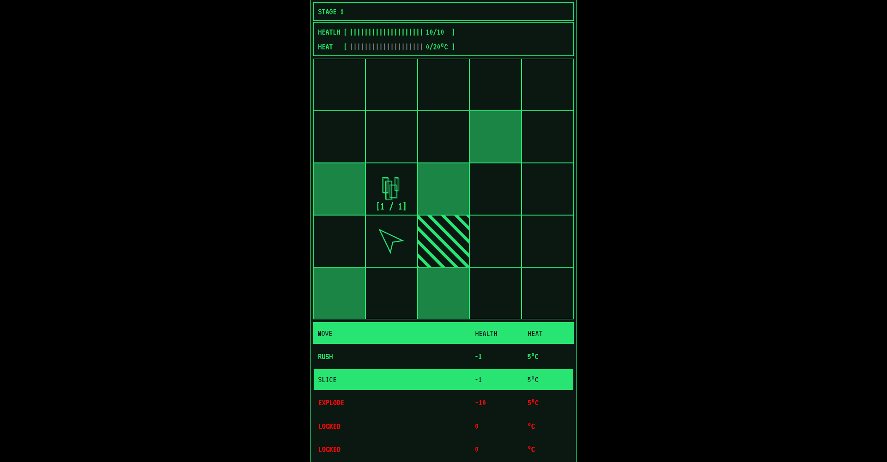

# Tris

This project is a sample game project I used to learn VueJS3.



In this game your objective to clear all enemies on the stage by using the available moves on the bottom.

## Guide

- If your health reaches zero, the game restarts
- Every move consume your health and increase your heat
- Every turn your heat decreases

## Recommended IDE Setup

[VSCode](https://code.visualstudio.com/) + [Volar](https://marketplace.visualstudio.com/items?itemName=Vue.volar) (and disable Vetur) + [TypeScript Vue Plugin (Volar)](https://marketplace.visualstudio.com/items?itemName=Vue.vscode-typescript-vue-plugin).

## Customize configuration

See [Vite Configuration Reference](https://vitejs.dev/config/).

## Project Setup

```sh
npm install
```

### Compile and Hot-Reload for Development

```sh
npm run dev
```

### Compile and Minify for Production

```sh
npm run build
```
